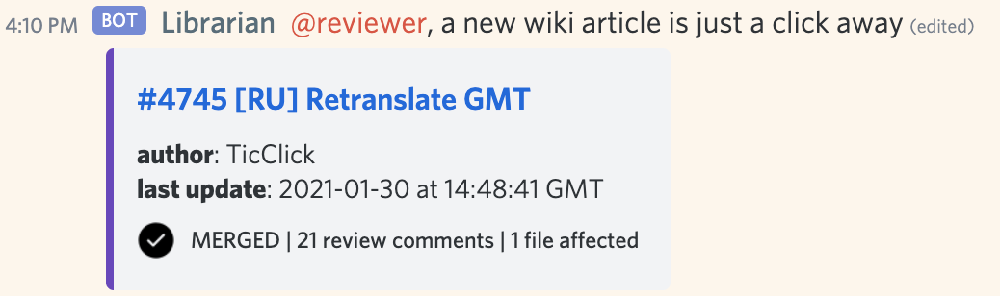

# Librarian



## overview

a Discord bot that tracks new pull requests of the [ppy/osu-wiki](https://github.com/ppy/osu-wiki) repository. it's a GitHub web hook, except not really:

- it's not a GitHub web hook, it's a service you have to host
- it can be repurposed for another repository you don't own (as well as `ppy/osu-wiki`)
- it's stateful (has its own local database to work around API slowness)
- it has latency (up to 2 minutes in a worst case scenario)
- you can talk to it using miscellaneous commands. sometimes it replies

## features

- notify reviewers in Discord about new relevant pull requests
- pin a pull request in Discord and keep track of it until it's closed
- merge statistics over a time period

## commands

- `.help` for general overview
- `.help commandname` for details on `commandname`

## usage

I'm considering providing it as a service, but there's a long way to go. for now, [set it up yourself](#host-your-own-installation).

## host your own installation

1. [create a Discord application](https://discord.com/developers/applications) and add a bot account to it.
2. add the bot to your server using a modified version of an OAuth2 authorization link from [Bot Authorization Flow](https://discord.com/developers/docs/topics/oauth2#bot-authorization-flow).
3. clone the repository:
    ```bash
    git clone https://github.com/TicClick/librarian
    ```
    create a modified version of `config/config.example.yaml` and fill in whatever data you need
4. to benefit from GitHub's extended API limits, query it using an API token (get one at [Personal access tokens](https://github.com/settings/tokens))

to update to the last stable version, stop the bot and execute:

```bash
git fetch && git checkout main
git pull origin main
git checkout $( git tag --list --sort=v:refname | tail -n 1 )
```

to setup the bot, run it, and be able to leave the shell without it terminating:

```bash
./bin.sh setup
tmux new -d -s librarian "./bin.sh run --config /path/to/config"
```

to stop it:

```bash
tmux kill-session -t librarian
```

## maintenance

use `bin.sh` from the source directory:

```bash
./bin.sh setup  # install all dependencies
./bin.sh run --config /path/to/config.yaml  # takeoff in 5, 4, 3...
./bin.sh clean  # remove virtual environment and Python bytecode cache
./bin.sh test  # run unit tests with pytest
./bin.sh test -x -k TestDiscordCommands  # stop on first failure of a subset
./bin.sh coverage  # generate coverage data
./bin.sh cov  # print coverage stats in terminal
./bin.sh hcov  # render and open a nice HTML with coverage stats
```

if anything goes wrong, make extensive use of a runtime log located at `{runtime}/librarian.log`

## credits

see `requirements.txt` for a list of cool packages