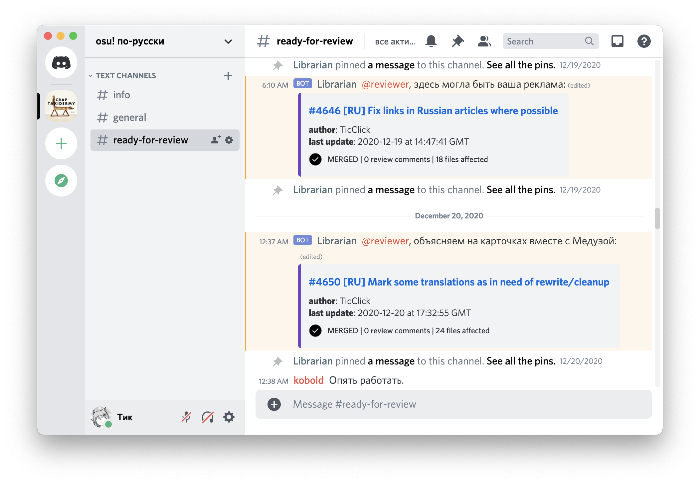

# Librarian



## overview

a Discord bot that tracks new pull requests of the [ppy/osu-wiki](https://github.com/ppy/osu-wiki) repository. it's a GitHub web hook, except not really:

- it's not a GitHub web hook, it's a chat bot you need to invite to your server
  - to spin up your own installation, see [`selfhosting.md`](docs/selfhosting.md)
- it can be repurposed for another repository you don't own (as well as `ppy/osu-wiki`)
- it's stateful (has its own local database to work around API slowness)
- it has latency (up to 2 minutes in a worst case scenario)
- you can talk to it using miscellaneous commands. sometimes it replies

### features

- notify reviewers in Discord about new relevant pull requests
- pin a pull request in Discord and keep track of it until it's closed
- merge statistics over a time period

## usage

*(a cordial reminder is that the bot must be allowed to post text messages if you expect it to be of any use)*

- [](https://discord.com/api/oauth2/authorize?client_id=742750842737655830&permissions=11264&scope=bot) to your server
- set up a channel for announcements using the `.set` command (available for server owner/admins/managers):
    ```
    .set language ru
    .set reviewer-role @role_mention  # optional, if you want to receive pings
    ```
- use `.help` for general overview
- use `.help commandname` for details on `commandname`

## credits

- bot avatar by [@drstrange777](https://twitter.com/drstrange777)
- PR status icons by [some GitHub teams](https://github.com/primer/octicons)
- see `requirements.txt` for a list of cool packages
